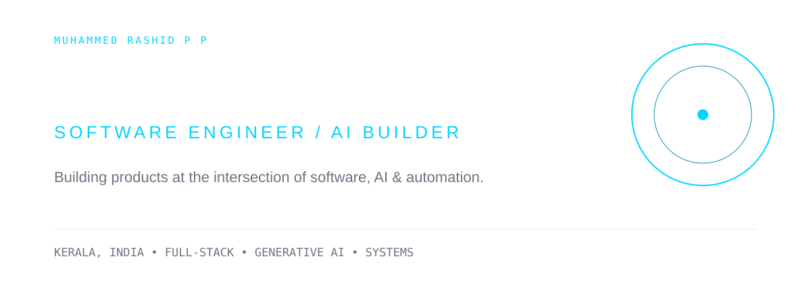
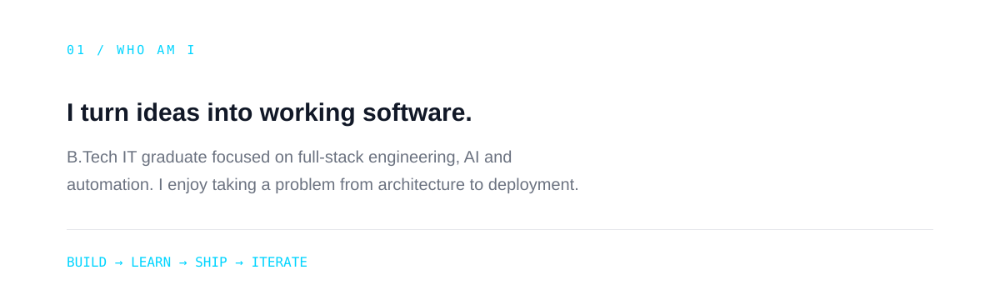
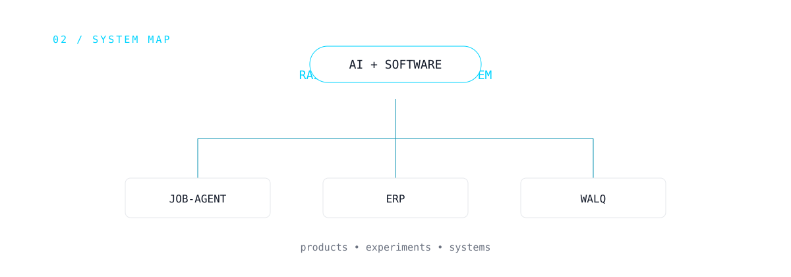
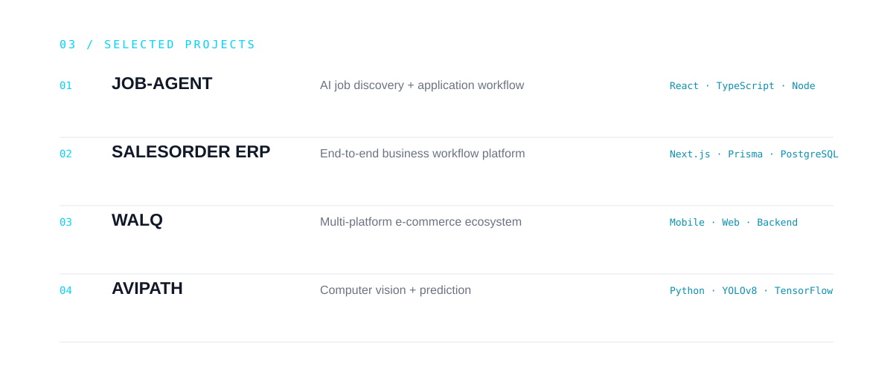
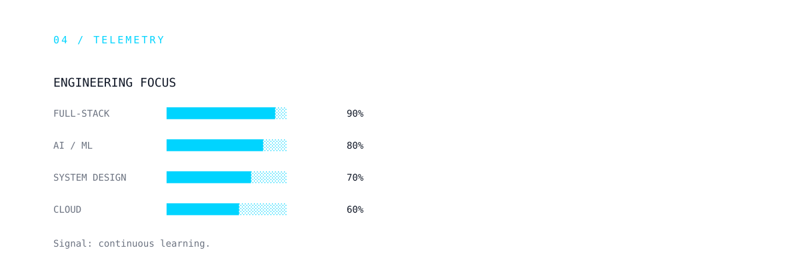
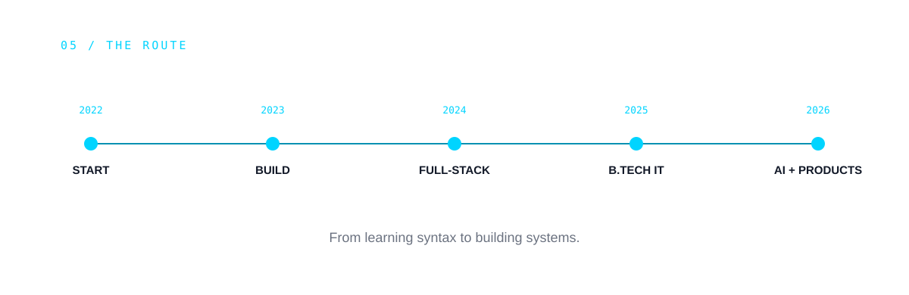
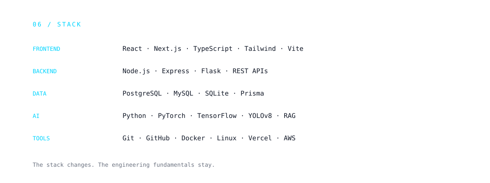

<picture><source media="(prefers-color-scheme: dark)" srcset="assets/dark/header.svg"/></picture>

<a href="https://gate2027-azure.vercel.app/">PORTFOLIO</a>
&nbsp; · &nbsp;
<a href="https://github.com/Rashidrxq">GITHUB</a>
&nbsp; · &nbsp;
<a href="https://www.instagram.com/rshidxxmhd">INSTAGRAM</a>

<picture><source media="(prefers-color-scheme: dark)" srcset="assets/dark/whoami.svg"/></picture>

<picture><source media="(prefers-color-scheme: dark)" srcset="assets/dark/ecosystem.svg"/></picture>

<picture><source media="(prefers-color-scheme: dark)" srcset="assets/dark/projects.svg"/></picture>

### FEATURED LINKS

<a href="https://github.com/Rashidrxq/Job-Agent">JOB-AGENT →</a>
&nbsp;&nbsp;·&nbsp;&nbsp;
<a href="https://sales-order-erp-remex.vercel.app/">SALESORDER ERP →</a>
&nbsp;&nbsp;·&nbsp;&nbsp;
<a href="https://github.com/Rashidrxq/SalesOrder-ERP-REMEX">SOURCE →</a>

  

<picture><source media="(prefers-color-scheme: dark)" srcset="assets/dark/telemetry.svg"/></picture>

<picture><source media="(prefers-color-scheme: dark)" srcset="assets/dark/github-stats.svg"/></picture>

<picture><source media="(prefers-color-scheme: dark)" srcset="https://github-readme-activity-graph.vercel.app/graph?username=Rashidrxq&bg_color=00000000&color=ffffff&line=00d4ff&point=ffffff&area_color=00d4ff&area=true&hide_border=true&radius=0&custom_title=CONTRIBUTION%20TELEMETRY"/></picture>

<picture><source media="(prefers-color-scheme: dark)" srcset="assets/dark/timeline.svg"/></picture>

<picture><source media="(prefers-color-scheme: dark)" srcset="assets/dark/stack.svg"/></picture>

## CURRENTLY BUILDING

**AI engineering · RAG · AI agents · Full-stack products · Automation**

 

<a href="https://gate2027-azure.vercel.app/">PORTFOLIO →</a>
&nbsp;&nbsp;·&nbsp;&nbsp;
<a href="https://github.com/Rashidrxq">EXPLORE GITHUB →</a>

<picture><source media="(prefers-color-scheme: dark)" srcset="assets/dark/footer.svg"/></picture>

<!-- Designed for Rashid — inspired by visual portfolio-style GitHub profiles, with original assets. -->
